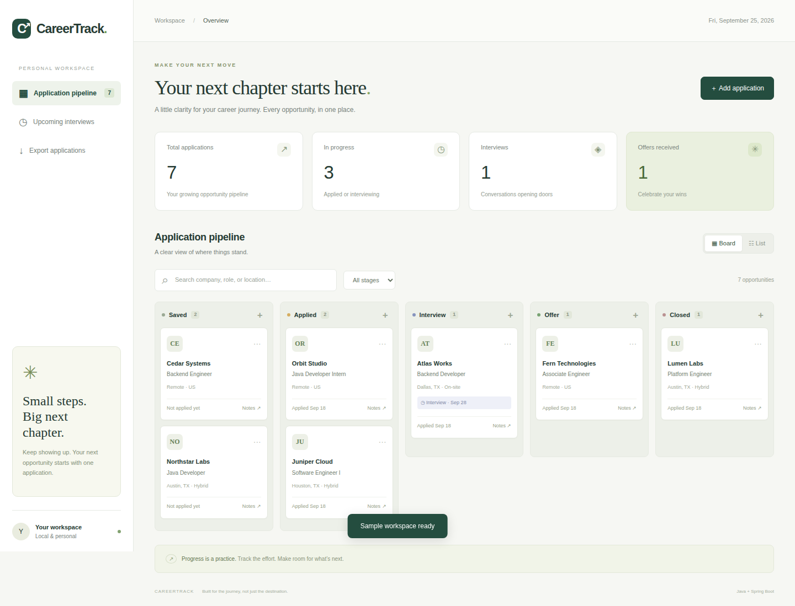
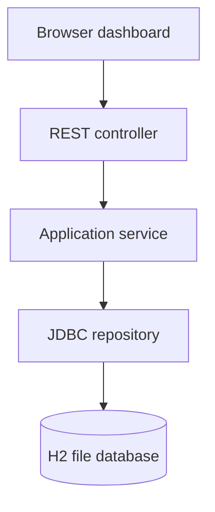

<div align="center">

# CareerTrack ↗
### A little clarity for your career journey.

A personal job application workspace built with **Java 17 + Spring Boot**.<br>
Track opportunities, prepare for interviews, and keep your next move in focus.

[](https://github.com/ayushkharel1/careertrack-java/actions/workflows/ci.yml)


</div>



## Why I built this

Job searching involves more than sending applications. Keeping track of stages, dates, and preparation notes can quickly become scattered. CareerTrack brings those details into one focused workspace while demonstrating a complete Java web application—from REST endpoints and SQL persistence to an accessible browser interface.

## What it does

- **Visual pipeline:** Saved → Applied → Interview → Offer → Closed. Click any card to edit its stage.
- **Dashboard:** Total applications, active opportunities, interviews, and offers.
- **Board and list views:** Search company, role, or location; filter by stage.
- **Interview planning:** View interviews scheduled for today or later.
- **Persistent storage:** Embedded, file-backed H2 database; no database installation required.
- **Safe edits:** Version checks prevent stale browser tabs from overwriting newer changes.
- **CSV export:** Quoted fields and spreadsheet formula neutralization.
- **Responsive interface:** Keyboard-accessible forms, visible focus, status messages, and mobile layouts.
- **Optional demo data:** Seven explicitly fictional opportunities, added only when requested in an empty workspace.

## Run locally

Install **JDK 17 or later** and **Maven 3.6.3 or later**. Then:

```bash
git clone https://github.com/ayushkharel1/careertrack-java.git
cd careertrack-java
mvn spring-boot:run
```

Open **http://127.0.0.1:8080**. Choose **Explore with sample data** for a guided first look, or add your own application.

Build a runnable JAR:

```bash
mvn clean verify
java -jar target/careertrack-1.0.0.jar
```

Run tests alone with `mvn test`. GitHub Actions also builds and tests each push and pull request, and uploads the packaged JAR as a workflow artifact.

### Data and privacy

This version is a **single-user local application**, not a hosted multi-user service. It binds to `127.0.0.1` by default and has no login system. Do not expose it publicly without adding authentication, authorization, TLS, and deployment hardening. The browser-write guard is defense in depth, not user authentication.

Your records are stored under `data/` relative to the working directory. That directory is excluded from Git. Stop the app before backing it up. Run the app from the same directory each time to use the same database. The application uses no external fonts, analytics, or browser-side libraries.

## Architecture



| Layer | Responsibility |
| --- | --- |
| Browser | Rendering, filtering, form feedback; user content inserted as text |
| Controller | HTTP semantics, request validation, JSON and CSV responses |
| Service | Date rules, missing-record handling, conflict handling, CSV encoding |
| Repository | Parameterized SQL, persistence, atomic version checks |
| Safety filter | Same-origin browser guard and response security headers |

The project intentionally uses Spring JDBC to keep SQL visible and understandable. Java records model requests and responses; constructor injection makes dependencies explicit. There is no frontend build step.

## REST API

| Method | Endpoint | Purpose |
| --- | --- | --- |
| GET | `/api/applications` | List all applications, newest first |
| GET | `/api/applications/{id}` | Fetch an application |
| POST | `/api/applications` | Create an application; returns 201 and Location |
| PUT | `/api/applications/{id}` | Replace editable fields; requires current `version` |
| DELETE | `/api/applications/{id}?version=0` | Delete if the version matches |
| GET | `/api/applications/export` | Download all applications as CSV |

Writes require the `X-Requested-With: CareerTrack` header. Example:

```bash
curl -X POST http://127.0.0.1:8080/api/applications \
  -H 'Content-Type: application/json' \
  -H 'X-Requested-With: CareerTrack' \
  -d '{"company":"Example Labs","role":"Java Developer","location":"Houston, TX","stage":"SAVED","notes":"Review the role requirements"}'
```

Stage values: `SAVED`, `APPLIED`, `INTERVIEW`, `OFFER`, `CLOSED`. Dates use `YYYY-MM-DD`; optional dates can be null. Application dates cannot be in the future, and interview dates cannot precede the application date. Errors return a `message` field, with 400 for invalid input, 404 for missing records, and 409 for stale edits. Listing and export are unpaginated, appropriate for a personal tracker.

## Tests and engineering details

The integration suite exercises real controllers, validation, services, and JDBC against an isolated in-memory H2 database. It covers:

- Create → read → update → delete, normalization, and version increments.
- Invalid stages, blank fields, malformed/future dates, and inconsistent dates.
- Missing records and missing update versions.
- Stale updates and deletes.
- CSV download headers, quoting, and formula neutralization.
- Browser request guards, security headers, and optional fields.

See [architecture and interview notes](docs/ARCHITECTURE.md) for tradeoffs and extension ideas.

## Next steps

- PostgreSQL profile and versioned Flyway migrations.
- Authenticated multi-user workspaces with record ownership.
- Pagination and server-side search for larger datasets.
- Application history and follow-up reminders.

These are roadmap items, not features implemented in this release.
